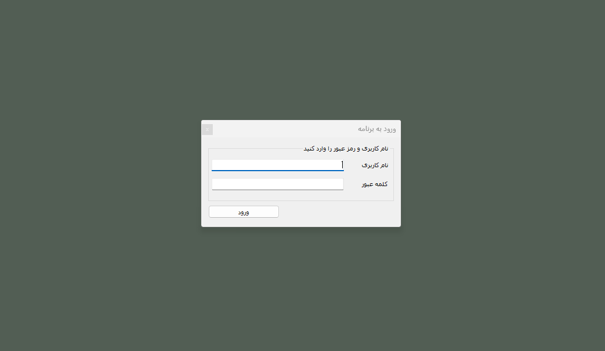
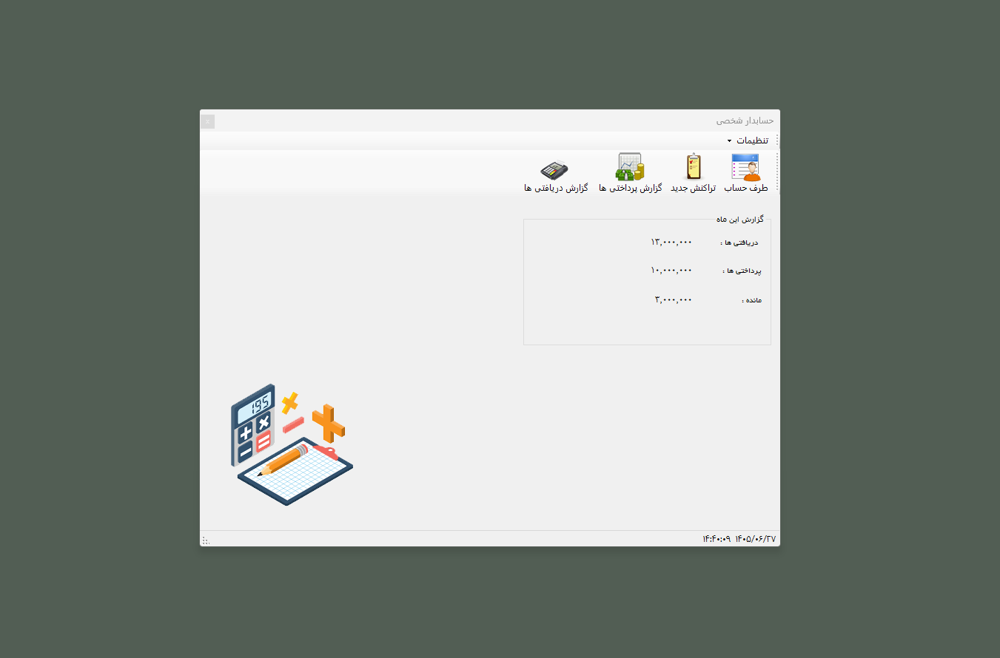
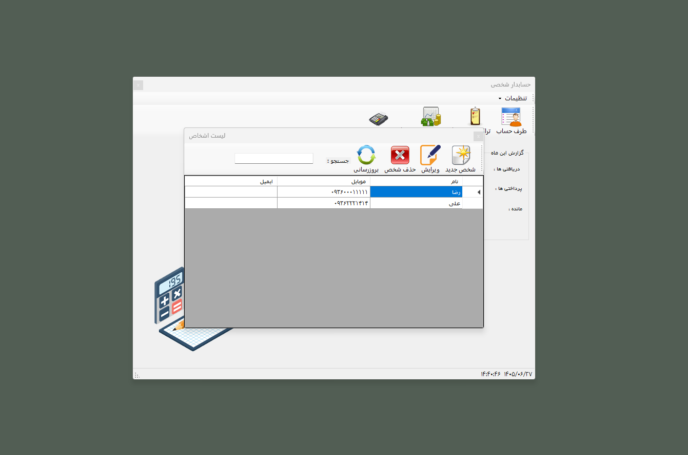

# Accounting App – WinForms

A personal accounting application built with **C#**, **.NET Framework 4.8**, **Windows Forms**, **Entity Framework 6**, and **SQL Server**.

The application is designed to help users manage their personal financial activities, including customers, income, expenses, and financial reports.

## Technologies Used

* C#
* .NET Framework 4.8
* Windows Forms
* Entity Framework 6
* SQL Server
* LINQ
* Repository Pattern
* Unit of Work Pattern

## User Interface

### Login

### Main Dashboard

### Customer Management

### Add / Edit Customer

### Income / Receipt

### Expenses / Payments

### Financial Reports

## About the Project

This project was developed as a personal accounting application and as a practical project for learning and applying **C#**, **.NET**, **Entity Framework**, database management, and software architecture concepts.

## License

This project is intended for educational and portfolio purposes.
